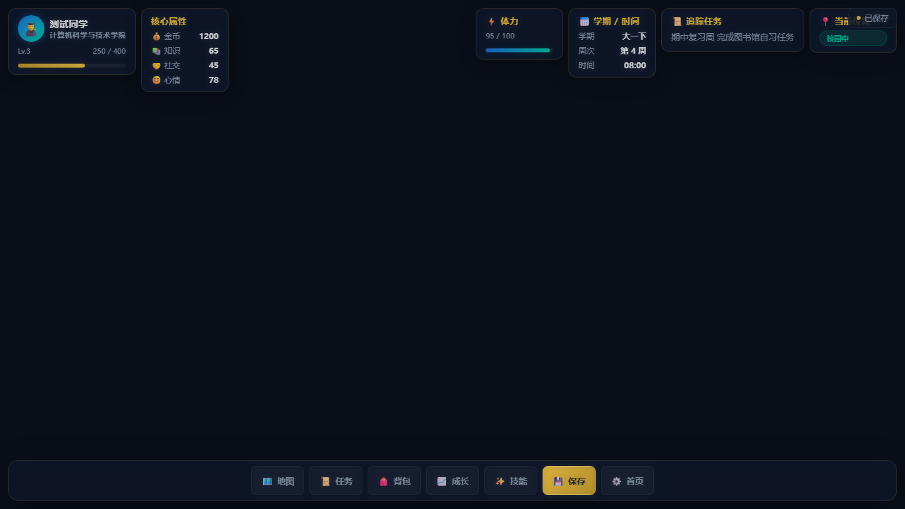
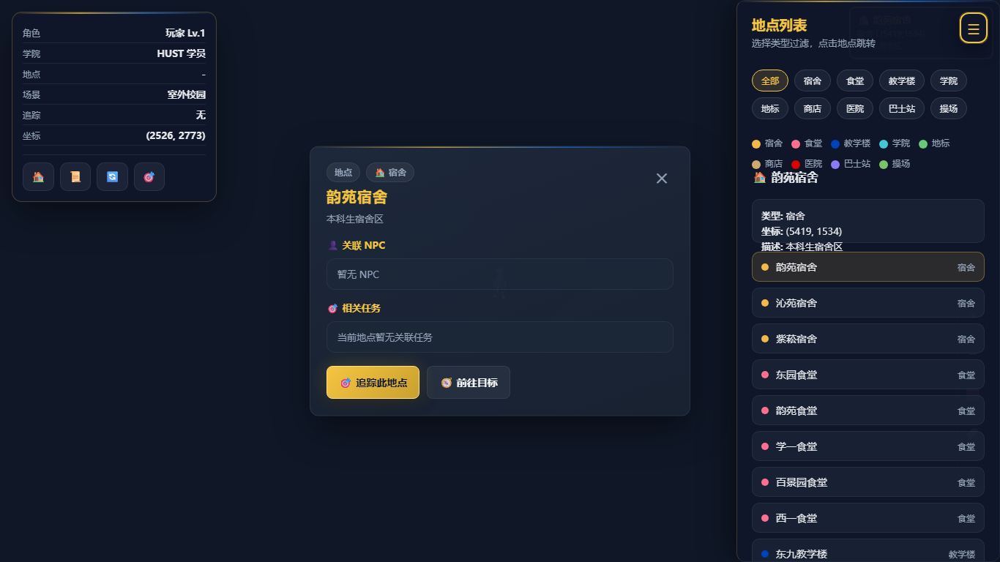
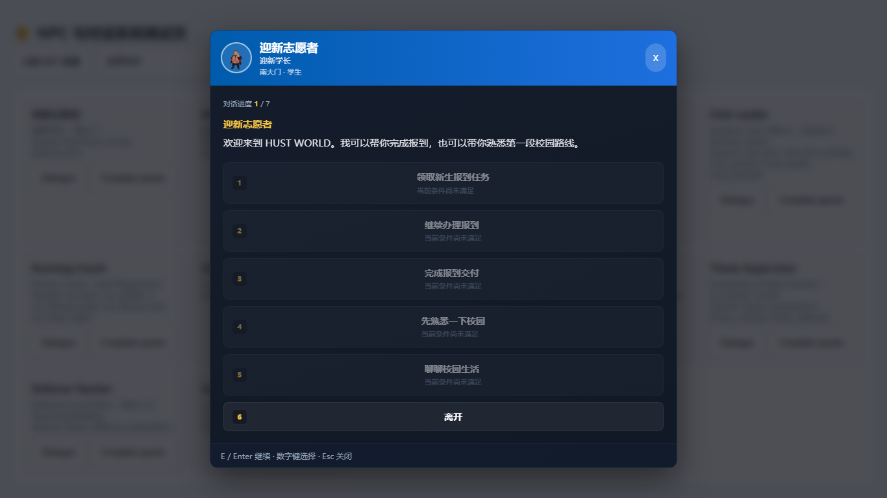
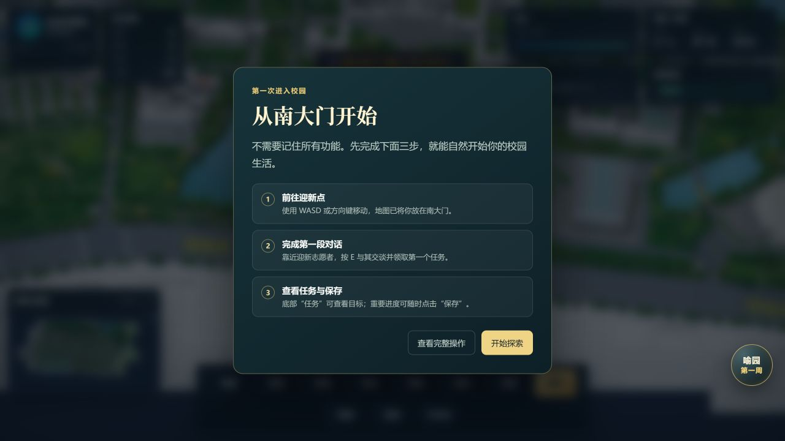
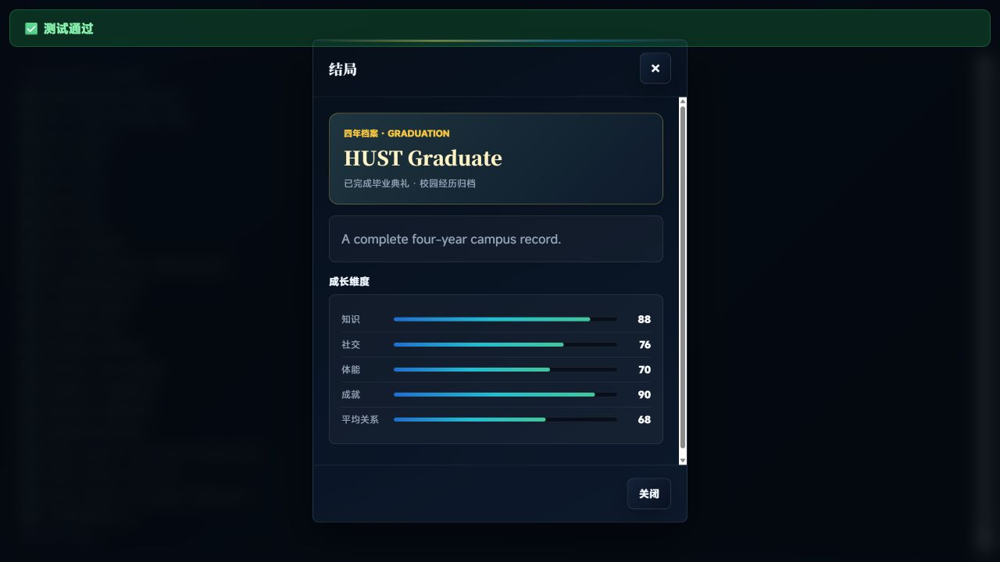

# HUST WORLD · Personal Edition

[](https://github.com/Jiatong1008/HUST-WORLD/actions/workflows/ci.yml)

> 一款以华中科技大学校园生活为灵感的 Web 校园模拟 RPG。探索校园、完成课程与社团任务，并从大一入学走向大四毕业。

这是由 **Jiatong**（[Jiatong1008](https://github.com/Jiatong1008)）持续维护和迭代的个人作品集项目。



## 项目亮点

- **大学四年完整闭环**：覆盖 8 个学期、主线任务、角色成长、毕业典礼、毕业成就与结局档案；关键流程有自动化回归测试保障。
- **真实校园叙事切片**：「喻园第一周」将新生报到、图书馆学习、醉晚亭夜游与帮助下一位新同学串成可保存、可回看的四段式校园故事。
- **可探索的校园体验**：以南大门为出生点，支持地图移动、POI 探索、室内场景、NPC 对话、任务追踪、社团、课程、跑步、背包与技能系统。
- **面向产品展示的 UI**：统一 HUD、任务日志、地图、成长/背包/技能面板与移动端适配；毕业结局以「四年档案」呈现成长结果。
- **工程化质量保障**：提供浏览器回归、API 冒烟、端到端检查、质量门禁、Docker 配置和 GitHub Actions 持续集成。

| 校园地图 | 对话与任务 |
| --- | --- |
|  |  |

## 个人体验亮点

| 从南大门开始 | 四年毕业档案 |
| --- | --- |
|  |  |

新手引导以南大门为起点，帮助玩家完成首次移动、NPC 对话、任务查看与保存；毕业后则以「四年档案」回顾角色的成长维度与校园经历。

## 我负责的个人迭代

本项目起源于团队课程设计。我在保留原项目团队贡献说明的前提下，负责个人版本的持续迭代，重点包括：

- 「喻园第一周」叙事闭环、记忆卡、倾向统计与结局设计；
- 南大门出生点、四年学期流转、毕业结局和新手引导；
- 游戏主界面与地图 UI 的产品化、响应式和可访问性优化；
- 浏览器自动化测试、质量门禁、发布前检查与部署文档；
- 个人作品集展示材料、素材来源登记与 GitHub 仓库维护。

详细边界与署名说明见 [个人版本说明](docs/personal/README.md)。

## 技术栈

- **前端**：原生 HTML / CSS / JavaScript，Canvas 与 DOM 混合交互
- **服务端**：Node.js、Express、MySQL 8、JWT、bcryptjs
- **测试**：Playwright 浏览器回归、API 冒烟、端到端测试、质量门禁
- **交付**：Docker Compose、GitHub Actions

## 本地运行

**前置条件**：Node.js 18+。完整登录、云端存档等服务端功能需要 MySQL 8；仅体验地图和前端玩法时，项目可在数据库不可用的降级模式下启动。

```bash
npm install
Copy-Item .env.example .env   # PowerShell
npm start
```

打开 [http://localhost:8080/game/](http://localhost:8080/game/) 开始游戏。首次进入会从 **南大门** 出发。

如需启动项目内置的开发数据库：

```bash
node tools/database/start-mysql-dev.js
```

更多环境变量、Docker 与部署步骤见 [运行与部署手册](docs/quality/deployment-runbook.md)。

## 测试

```bash
# 日常改动：质量门禁与核心 UI 回归
npm run test:quick

# 提交前：服务、API、端到端流程
npm run test:standard

# 发布前：完整回归矩阵
npm run test:full

# 大一入学 → 大四毕业的完整生命周期
npm run test:four-year
```

目前四年生命周期测试覆盖 8 次学期结束、学年切换、毕业任务、毕业成就和毕业结局生成。测试策略见 [测试矩阵](docs/quality/test-matrix.md)。

## 项目结构

```text
game/                 游戏主界面、玩法系统与 UI
map/                  校园地图、POI、室内场景与地图 UI
server.js             Express 服务入口
config/               数据库与服务端配置
tools/tests/          浏览器、服务与质量自动化测试
docs/personal/        个人迭代边界、叙事设计与维护说明
docs/showcase/        截图、展示材料与验收报告
```

## 设计与展示材料

- [喻园第一周：叙事与交互设计](docs/personal/hust-week-design.md)
- [UI/UX 展示与简历亮点](docs/showcase/ui-ux-showcase.md)
- [路线图](docs/plan/roadmap.md)
- [素材来源与使用说明](docs/ASSET_ATTRIBUTION.md)

## 贡献与许可

欢迎通过 Issue 或 Pull Request 提出建议。协作方式见 [CONTRIBUTING.md](CONTRIBUTING.md)。

代码采用 [MIT License](LICENSE)。请在公开传播或二次使用校园图片、校徽及其他素材前，先核对 [素材来源与使用说明](docs/ASSET_ATTRIBUTION.md)。
